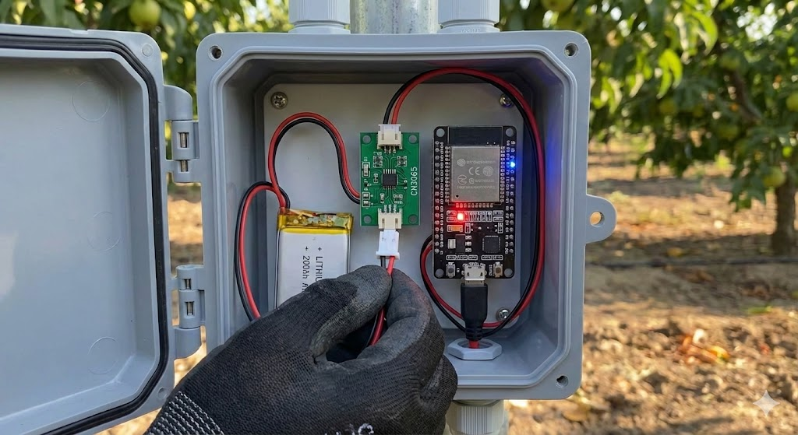

# Guía de Uso y Operación

Bienvenido al manual de operación del sistema de monitoreo **CostaFrut**. Esta guía explica los pasos necesarios para poner en marcha los nodos y utilizar la plataforma de gestión.

---

## 1. Puesta en Marcha del Nodo

Una vez instalado el nodo físico en el campo, sigue estos pasos para iniciarlo correctamente.

### Paso 1: Conexión de Energía
El sistema está diseñado para ser autónomo, pero requiere una conexión inicial de la batería.
1.  Abra la caja estanca con cuidado.
2.  Localice el conector de la batería (cable rojo y negro).
3.  Conéctelo firmemente al módulo de carga **CN3065**.

!!! warning "Precaución"
    Asegúrese de que la polaridad sea correcta (Rojo con Rojo, Negro con Negro) para evitar daños en el circuito.

### Paso 2: Verificación de LEDs
Al conectar la energía, observe los indicadores luminosos en el microcontrolador **ESP32**:
 **LED Rojo (Power):** Debe encenderse y permanecer fijo. Indica que el sistema recibe energía.
 **LED Azul (Status):** Debería parpadear brevemente al inicio, indicando que está intentando conectarse a la red LoRa.

---

## 2. Interpretación de Datos en Plataforma

Una vez que el nodo está encendido, los datos comenzarán a visualizarse en la plataforma web central.

### Lectura del Dashboard
El panel principal muestra el estado en tiempo real de cada sector.

| Indicador | Qué significa | Valor Óptimo |
| :--- | :--- | :--- |
| **Humedad de Suelo** | Porcentaje de agua disponible en la raíz. | **20% - 30%** |
| **Temperatura** | Temperatura del suelo a profundidad. | **15°C - 25°C** |
| **Estado Batería** | Nivel de carga del nodo. | **> 3.7V** |

!!! tip "Consejo de Riego"
    Si la humedad desciende del **20%**, el sistema generará una alerta automática sugiriendo activar el riego.

### Gráficos Históricos
Haga clic en cualquier tarjeta de sensor para ver el historial. Esto es útil para detectar patrones, como la rapidez con la que se seca el suelo después de un día caluroso.

---

## 3. Procedimiento ante Alertas

El sistema clasifica el estado del cultivo en dos categorías: **Normal** y **Anormal**.

###  Caso: Alerta de "Humedad Crítica"
Si recibe una notificación de humedad baja (<15%):
1.  **Verifique:** Acceda al dashboard y confirme que no sea un error de lectura (ej. batería baja).
2.  **Acción:** Si la lectura es correcta, active el riego manual o verifique si el riego automático se inició.
3.  **Validación:** Espere 30 minutos y revise si la humedad comienza a subir en el gráfico.

### Caso: Alerta de "Exceso de Riego"
Si la humedad supera el 40% constantemente:
1.  Podría indicar una fuga en la cinta de riego o un emisor dañado cerca del sensor.
2.  Se recomienda inspección visual en terreno.

---

## 4. Mantenimiento Básico

Para asegurar la vida útil del equipo, realice estas acciones cada 3 meses:

* **Limpieza del Panel Solar:** Pase un paño húmedo sobre el panel para eliminar polvo y garantizar la carga máxima.
* **Revisión de Estanqueidad:** Verifique que la caja esté bien cerrada y no haya humedad condensada en su interior.
* **Inspección de Cables:** Asegúrese de que ningún cable haya sido mordido por roedores o dañado por maquinaria.

!!! success "Soporte Técnico"
    Si detecta un comportamiento errático en los sensores que no se soluciona con el reinicio (desconectar y conectar batería), contacte al equipo técnico de soporte interno.